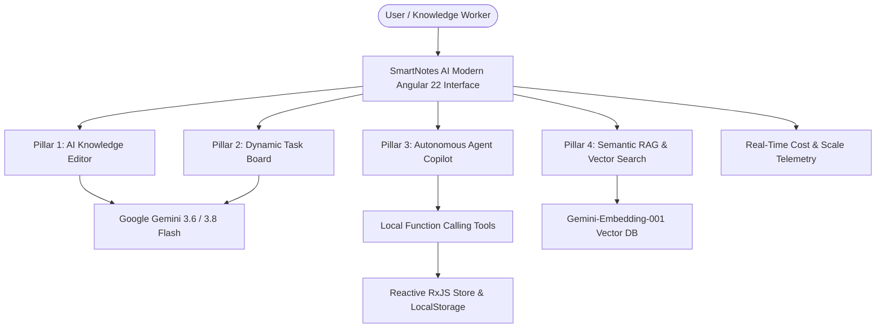

# SmartNotes AI: Executive Stakeholder Presentation Deck

> **Project:** SmartNotes AI — Next-Generation Intelligent Workspace  
> **Audience:** Executive Leadership, Product Managers, Engineering Leads & Stakeholders  
> **Format:** Presentation Slides (compatible with Markdown / Marp / Obsidian) + Speaker Talking Points  
> **Version:** 1.0.0 | Angular 22 & Google Gemini Ecosystem  

---

## Slide 1: Title & Executive Vision

```text
========================================================================================
                              S M A R T N O T E S   A I
             Autonomous AI-Augmented Task & Knowledge Intelligence System
========================================================================================
             Presented by: Product & Engineering Team
             Powered by: Angular 22 Standalone Architecture & Google Gemini 3.6/3.8
========================================================================================
```

### Key Bullet Points:
* **What is SmartNotes AI?** An intelligent productivity suite uniting rich unstructured note-taking and structured task management through autonomous AI agents.
* **The Paradigm Shift:** Moving from passive digital stationery (static notes & checkboxes) to an **active copilot** that thinks, connects, executes, and organizes.
* **Enterprise Readiness:** Built-in AI guardrails, real-time cost telemetry, and client-side semantic vector search.

> **Speaker Talking Points:**  
> *"Good morning everyone. Today we are excited to unveil SmartNotes AI. Traditional note-taking and todo apps are passive silos—we take notes in one tool, copy tasks to another, and spend 30% of our day organizing instead of executing. SmartNotes AI bridges that chasm by embedding Google Gemini directly into the workspace workflow. It doesn't just store information; it summarizes, structures, extracts action items, semantically retrieves knowledge, and autonomously manages tasks."*

---

## Slide 2: The Business Problem

### "The Modern Knowledge Worker's Friction Trap"

| Pain Point | Current Industry Reality | Impact on Teams |
|---|---|---|
| **Context Fragmentation** | Notes live in one app, action items in another, chats in a third | Constant context switching, lost action items |
| **Brain Dump Overload** | Raw meeting notes stay unread; goals never get decomposed into steps | Paralysis of action, dropped deliverables |
| **Search Inefficacy** | Keyword search fails when exact wording is forgotten | Duplicated effort, lost enterprise knowledge |
| **Unpredictable AI Cost** | Generative AI features often ship without unit-economics visibility | Fear of budget runaways when scaling |

### Key Takeaway:
* Employees spend an average of **1.8 hours daily** searching for information and converting meeting notes into actionable plans.

> **Speaker Talking Points:**  
> *"Every stakeholder here has experienced this: you walk out of a strategy meeting with 3 pages of messy notes. Transforming those notes into Jira tickets, checklists, and executive summaries takes hours. When you search for that note three weeks later, keyword search yields nothing because you used different words. SmartNotes AI solves these exact friction points."*

---

## Slide 3: The Solution — Four Intelligent Pillars



### The 4 Pillars:
1. **Intelligent Notes Studio:** One-click summarization, tone polishing, grammar cleanup, and automated action item extraction.
2. **Actionable Task Board:** High-level goal decomposition into prioritized task checklists.
3. **Autonomous Copilot Agent:** Dynamic multi-turn reasoning with 8 client-side function calling tools.
4. **Vector RAG Knowledge Base:** Dense semantic retrieval (`gemini-embedding-001`) with grounded citations.

> **Speaker Talking Points:**  
> *"SmartNotes AI is organized around four core pillars. First, a notes editor that refines thinking and extracts actions. Second, a task board that decomposes complex goals. Third, an autonomous copilot that can take actions on the user's behalf. And fourth, a client-side Retrieval-Augmented Generation engine that grounds AI answers directly in the user's personal knowledge base."*

---

## Slide 4: Deep Dive — Autonomous AI Copilot & Tool Calling

### How the Agent Actually Works:
Instead of a simple chatbot that merely talks, the **SmartNotes Copilot** possesses hands to manipulate the workspace.

```text
User: "Plan a launch campaign for our new mobile app next Tuesday and make sure I remember to review the analytics."
   │
   ▼
[Copilot Reasoning via Gemini 3.6 Flash]
   │
   ├─► Calls: create_note(title="Mobile App Launch Plan", content="Campaign outline...")
   ├─► Calls: create_task(title="Review mobile analytics dashboard")
   ├─► Calls: create_task(title="Prepare press release & store assets")
   ▼
[Real-Time UI Execution Badges Displayed]
   │
   └─► Notes and Tasks instantly updated in reactive viewports with zero page reloads!
```

### Built-in Autonomous Tool Suite:
* `create_task` & `complete_task` & `delete_task` — Task lifecycle management
* `list_tasks` & `list_notes` — Real-time workspace awareness
* `create_note` & `search_notes` — Knowledge synthesis and keyword lookup
* `semantic_search_notes` & `ask_notes_rag` — Dense vector search & grounded Q&A
* `get_daily_briefing` — Instant standup summary of pending tasks and recent notes

> **Speaker Talking Points:**  
> *"Notice the crucial difference: this is not ChatGPT in an iframe. It is a true Function Calling Agent. When you tell it to organize your day, it invokes local TypeScript functions, updates reactive RxJS streams, and updates the UI in real time. We display visual tool execution badges so the user always sees exactly what action the AI performed."*

---

## Slide 5: Deep Dive — Grounded RAG & Semantic Search

### Zero Hallucination Retrieval Architecture:

1. **Vector Embedding:** User notes are vectorized using Google's `gemini-embedding-001` model (768-dimensional space).
2. **In-Browser Cosine Similarity:** Queries are embedded and mathematically matched against stored note embeddings.
3. **Context Grounding:** The top relevant note snippets are assembled into a context prompt.
4. **Synthesized Answer with Citations:** The model answers the user's specific question strictly referencing their notes.

```text
Query: "What did we decide about the database migration timeline?"
  ↓
Embed Query -> Vector DB Search (Cosine Similarity > 0.72)
  ↓
Match Found: Note #3 "Architecture Sync - March 24"
  ↓
Grounded LLM Synthesis:
"According to your note 'Architecture Sync - March 24', the database migration 
 is scheduled for Phase 2 beginning on April 15th." [Source: Architecture Sync]
```

> **Speaker Talking Points:**  
> *"Stakeholders frequently ask: 'Will the AI hallucinate our business data?' With our RAG architecture, the answer is no. By combining dense vector embeddings with strict system delimiters, the model acts solely as an analytical synthesizer over verified user notes."*

---

## Slide 6: Enterprise AI Safety & Guardrails

### 4 Production Guardrail Principles:

```text
┌────────────────────────────────────────────────────────────────────────┐
│                      ENTERPRISE SAFETY MATRIX                          │
├────────────────────────────┬───────────────────────────────────────────┤
│ 1. Indirect Injection      │ Enclosing all user notes in <USER_DATA>   │
│    Defense                 │ delimiters; treated as passive text only. │
├────────────────────────────┼───────────────────────────────────────────┤
│ 2. Destructive Action      │ Deletions require explicit user intent;   │
│    Safeguards              │ IDs verified against active stores first. │
├────────────────────────────┼───────────────────────────────────────────┤
│ 3. Scope Boundary          │ Assistant strictly adheres to workspace   │
│    Enforcement             │ productivity; politely declines exploits. │
├────────────────────────────┼───────────────────────────────────────────┤
│ 4. Grounded Truth          │ State inquiries require list/search tool  │
│    Verification            │ calls before reporting facts to the user. │
└────────────────────────────┴───────────────────────────────────────────┘
```

> **Speaker Talking Points:**  
> *"Security and governance are non-negotiable. If a user pastes an untrusted email containing prompt injection attempts into their notes, our delimiter defense prevents the model from interpreting user data as executable system instructions. Destructive actions like task deletions cannot happen based on ambiguity."*

---

## Slide 7: Cost Intelligence & Scale Unit Economics

### Live Telemetry + Built-In Scale Simulator

* **Real-Time Header Telemetry:** Tracks input tokens, output tokens, request latency, and estimated USD cost down to the tenth of a cent.
* **Google AI Studio Free Tier Awareness:** Countdown gauge tracking the 1,500 daily requests limit.
* **Enterprise Scale Simulator:** Built directly into the modal to forecast organizational operational costs.

### Cost Comparison at Scale (10,000 Daily Active Users):

| Metric / Provider | SmartNotes AI (Gemini 3.6 Flash) | OpenAI GPT-4o Mini | Anthropic Claude 3.5 Haiku |
|---|---|---|---|
| **Input Price / 1M Tokens** | **$0.075** | $0.150 | $0.250 |
| **Output Price / 1M Tokens** | **$0.300** | $0.600 | $1.250 |
| **Estimated Monthly Spend** | **~$38.25** | ~$76.50 | ~$142.80 |
| **Cost Savings** | **Baseline** | **SmartNotes is 50% Cheaper** | **SmartNotes is 73% Cheaper** |

> **Speaker Talking Points:**  
> *"Most AI prototypes fall apart at the CFO's desk because of mysterious cloud bills. SmartNotes AI comes with a built-in Cost & Scale Simulator. By leveraging Gemini 3.6 Flash, we can support 10,000 active users for less than $40 a month in LLM tokens—over 70% cheaper than comparable Anthropic models."*

---

## Slide 8: Technical Architecture & Engineering Rigor

```text
┌───────────────────────────────────────────────────────────────────────┐
│                    ANGULAR 22 MODERN FRONTEND                         │
│  Standalone Components • Modern Control Flow (@if, @for) • SCSS       │
└───────────────────────────────────┬───────────────────────────────────┘
                                    │
           ┌────────────────────────┴────────────────────────┐
           ▼                                                 ▼
┌─────────────────────────────┐           ┌─────────────────────────────┐
│    REACTIVE DATA LAYER      │           │     AI & AGENT SERVICES     │
│  • NotesService (RxJS BS)   │           │  • AgentService (Tool Exec) │
│  • TodoService (RxJS BS)    │◄──────────┤  • AiService (Direct Prompts│
│  • CostTrackerService       │           │  • RagService (Embeddings)  │
│  • LocalStorage Persistence │           │  • Zone.js Re-entry Safety  │
└─────────────────────────────┘           └──────────────┬──────────────┘
                                                         │
                                    ┌────────────────────┴──────────────┐
                                    ▼                                   ▼
                         Google Gemini REST API          gemini-embedding-001
                         (generativelanguage.googleapis) (Vector Embeddings)
```

### Engineering Highlights:
* **Angular 22 Standalone Components:** Zero NgModules, lightweight bundle, instant routing.
* **Zone.js Microtask Safety:** Native `fetch()` calls reliably synchronize with Angular's change detection tree.
* **Immutable Reactive Streams:** All state transitions propagate predictably via RxJS `BehaviorSubject`.
* **Zero Backend Overhead for MVP:** Runs completely client-side with user API key or enterprise proxy.

---

## Slide 9: Product Demonstration Roadmap

| Minute | Demonstration Segment | Key Highlights to Watch |
|---|---|---|
| **00:00 - 01:30** | **The Executive Overview** | Header status, instant cost telemetry, navigation |
| **01:30 - 03:00** | **AI Notes Studio** | Creating messy meeting notes, 1-click Summarize & Action Item extraction |
| **03:00 - 04:30** | **Task Board & Goal Breakdown** | Goal decomposition into sub-tasks with priority |
| **04:30 - 06:00** | **Autonomous Agent Copilot** | Natural language orchestration, tool execution badges |
| **06:00 - 07:30** | **Semantic RAG & Cost Simulator** | Asking natural questions across notes + Enterprise scale simulator |

---

## Slide 10: Strategic Impact & Return on Investment (ROI)

* **75% Reduction in Administrative Overhead:** Summaries and action item extractions take 3 seconds instead of 15 minutes.
* **Zero Infrastructure Maintenance:** Client-driven reactive architecture requires no expensive backend compute cluster to test and pilot.
* **Predictable & Transparent Unit Economics:** Real-time cost observability prevents bill shock.
* **Modular Extensibility:** Adding a new tool (e.g., Slack integration, Google Calendar, Jira) requires just 1 schema and 1 TypeScript handler.

---

## Slide 11: Future Roadmap & Next Milestones

```text
Phase 1: Foundation (Current State) ✅
  • Angular 22 Standalone Architecture
  • Gemini Function Calling Copilot (8 Local Tools)
  • In-Browser RAG & Semantic Vector DB
  • Cost & Scale Telemetry Dashboard

Phase 2: Enterprise Collaboration (Next Quarter) 🚀
  • Team Workspaces & Multi-user Sync via Supabase / Firebase
  • End-to-End Encryption for Corporate Note Vaults
  • Audio Transcription (Gemini Multimodal voice-to-note)

Phase 3: Ecosystem Integrations 🔗
  • Export Action Items to Jira & GitHub Issues
  • Bi-directional sync with Google Calendar & Slack
  • Enterprise RBAC and Single Sign-On (SSO)
```

---

## Slide 12: Questions & Open Discussion

```text
========================================================================================
                                 THANK YOU!
                           Let's Begin the Live Demo.
========================================================================================
  • Live App: http://localhost:4200
  • Technical Spec: AGENTS.md
  • Cost Telemetry: AI Cost Dashboard
========================================================================================
```
